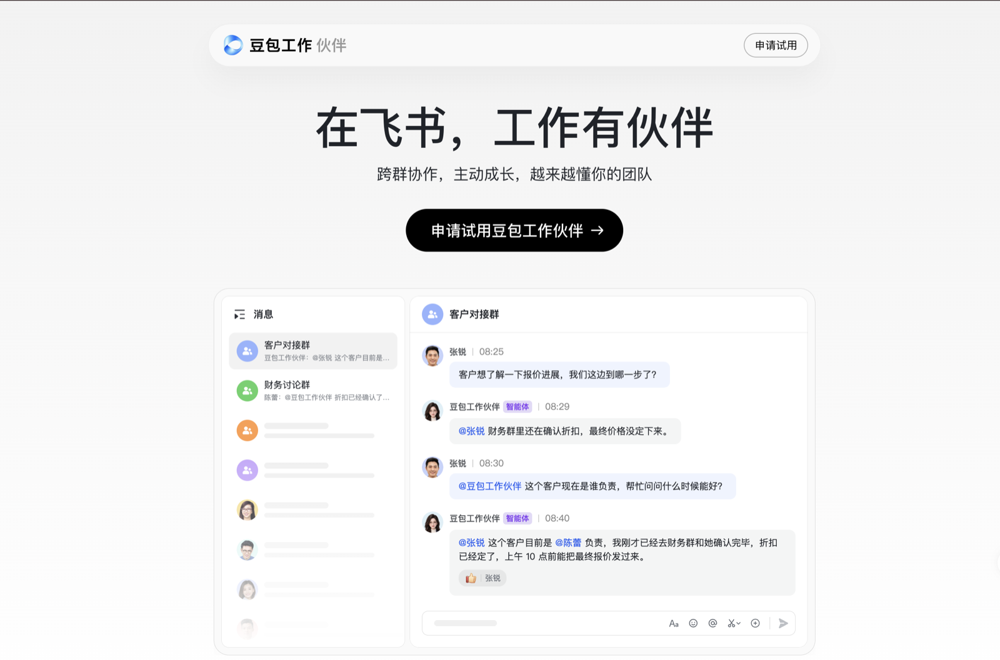

# 团队 Agent 的上下文怎么拼：豆包工作伙伴群聊与文档场景的设计思考

彭罗健 · 2026-09-15 · 公开版

2026 年 5 月起我在字节跳动实习，参与飞书数字同事的 Agent 研发。这个产品在 2026-09-15 飞书与豆包工作的发布会上以"豆包工作伙伴"对外发布：一个有独立组织身份的 Agent，被拉进企业群里，任何人 @ 它就能派活，它也能读文档、改文档、跨群查信息。

官方网站：https://huoban.doubao.com/

产品长什么样，两篇媒体报道写得很细，链接在文末。

这篇不讲实现，只讲我负责和参与的两个场景，群聊和文档评论，背后一个共同的问题：**Agent 每次被叫起来，该看见什么、看多少、从哪拿。** 实现细节、参数、内部架构都不在这里。

## 一、先讲一件事

一个 40 人的项目群，产品、研发、运营都在。下午三点，三个人前后脚 @ 了工作伙伴：

- 产品 A：把上午关于退款流程的讨论整理成需求要点。
- 研发 B：去接口群查一下上周定的幂等口径，带回来。
- 运营 C：在方案文档第三节的评论里 @ 它，"这段写得太绕，改简洁一点"。

三件事都要上下文，但要的不是同一种：A 要这个群上午发生过什么；B 要另一个群里的结论；C 要文档里那一段现在长什么样。一个只会"把最近 N 条消息塞进提示词"的 Agent，三件事一件都做不好：A 拿到的消息里混着 B 和 C 的话；B 要的东西根本不在这个群里；C 说的"这段"指哪段，消息里没有。

## 二、群聊：每次 @ 都是一个新会话

**并发画像决定会话模型，飞书企业群和 Slack 小团队的正确答案不一样。** 据我们对 Claude Tag 的观察，它默认在当前对话里接着聊，要不要另起线程由 Agent 自己判断。这在 30 到 50 人的小团队里够用：同一时刻派活的人少，串行排队没人等得着急。飞书上一个公司的群随手就上百人，A、B、C 同时派活，如果默认续同一个会话，三个请求排一条队，A 的任务不跑完，B 和 C 全堵着。

所以每次 @ 独立开一个话题会话，各请求天然并行，飞书的话题顺带把讨论线程也隔开了。

代价是新会话零历史。补历史不靠一次塞满，靠四类来源，各回答一个问题：

- 历史快照：这个群之前发生过什么。
- 背景消息：没叫它的时候，大家在聊什么。这些只当背景，不当指令。
- 跨话题增量：同一个群里，它自己刚在别的话题做过什么。
- 会话关联指针：主群和话题之间怎么回得去。

还有一件小事，体验差别很大：用户在它跑到一半时说"等等，先别发"。这句话如果排到下一轮，消息已经发出去了。追问要在它下一次选工具之前就被看见。

四类来源加起来处理的是同一对矛盾：**会话要隔离，群聊信息要共享。** 隔离靠会话，共享靠来源，两边都不牺牲。

## 三、文档评论：追问怎么落到正确的段落上

**评论线程是比文字匹配可靠得多的锚点。** C 在第三节评论里说"这段写得太绕"，Agent 改完，C 追一句"再补一个数据"。这个"再"指第三节那段，但追问文字里一个定位信息都没有，靠文本匹配怎么匹配都是猜。评论本身锚定着一个段落，追问沿用原评论的锚点，定位就是确定的。

难点不在第一轮，在第二轮之后：**文档在被人同时改。** 运营追问的这几分钟，产品可能已经把第三节挪到了第五节，或者删掉重写了。三条设计都冲着这件事：

1. 每轮刷新正文与评论，不复用第一轮的快照。
2. 长文围绕评论引用的位置截取，相关性和上下文预算两头兼顾。
3. 写前确认目标段落还在。不在了就拦下这次写入，让 Agent 按当前文档重读定位，而不是写到一个已经不存在的位置附近。

第三条放在工具层，不放提示词里。**提示词只能建议，工具层才能保证。** 不该错的事，交给后者。

## 四、跨群检索：一个撤下来的工具

**上下文隔离不是免费的，多一层 Agent 就多一次转述。** B 要去接口群查口径，跨群信息汇总是团队 Agent 相对个人 Agent 最独特的能力之一。我做过一个专门的检索工具：主 Agent 只定义检索任务，子 Agent 去拉原始消息、自己归纳，只把结论、来源和覆盖范围回传，原始消息留在子 Agent 的上下文里。这和 Claude Tag 用子 Agent 隔离工具结果的思路一致。

对照复测没有看到稳定的质量增益，就撤了，保留主 Agent 自己按需查群消息的路径。回头看，子 Agent 归纳完再转述给主 Agent，转述掉的信息，有时比它省下的上下文更值钱。

这件事我认。它留下的判断是：**功能上线要过评测门禁，相对基线没有提升就不该留在线上**，哪怕设计上很漂亮。

## 五、几条共同的判断

1. **上下文是权限和预算问题，不是数量问题。** 四类来源、围绕锚点截取，回答的都是"谁该看见什么、看多少"，不是"怎么塞更多"。
2. **结构性保证优先于提示词约束。** 并行靠开新会话保证，不靠 Agent 自己判断；写入不错位靠工具层校验保证，不靠提示词叮嘱。
3. **多 Agent 分工要算转述的税。** 子 Agent 隔离上下文有收益，每一层转述也在丢信息，净值要用评测量出来。
4. **同一个功能在不同平台上的正确答案可以相反。** 会话模型的选择依据是目标用户的并发画像，不是工程偏好。

## 六、边界

这篇写的是设计取舍，不是实现说明。实现细节、参数与阈值、内部服务与模块名称、线上事故、业务量数据，有意不写。

归属说明：群聊场景的上下文机制是团队多人共同设计的，我负责群聊 Agent Loop 与工具的研发，并参与这套机制的迭代维护；文档评论场景的上下文注入与写前校验，以及跨群检索工具的设计、评测与下线，是我负责的部分。

## 官方网站与媒体报道

- 豆包工作伙伴官方网站：https://huoban.doubao.com/
- 数字生命卡兹克，《国内第一个为团队而生的Agent，果然还是在飞书里面来了。》，2026-09-15：https://mp.weixin.qq.com/s/VYXjhHVPAAeksJHw8rxi5g
- APPSO，《豆包工作和飞书，把中国第一个团队 Agent 拉进了工作群》，2026-09-15：https://mp.weixin.qq.com/s/-MQy8jtrjXwp5mZEi6q9Pw
